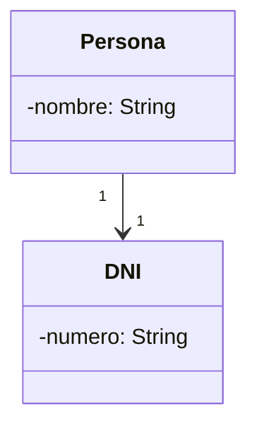
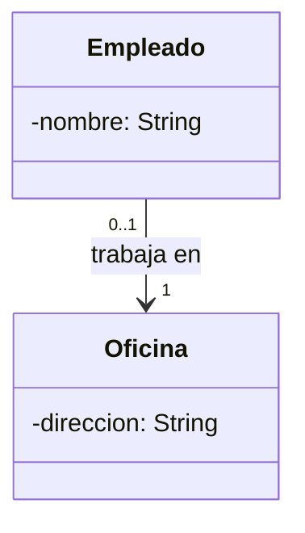
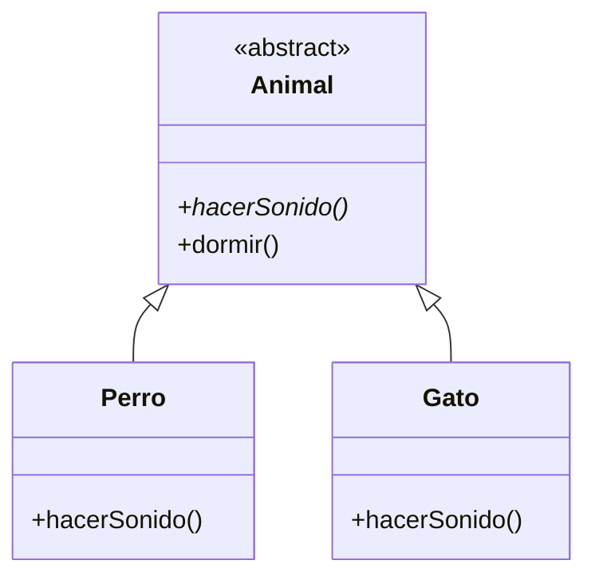
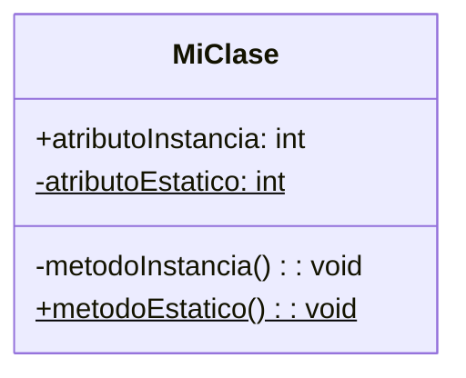
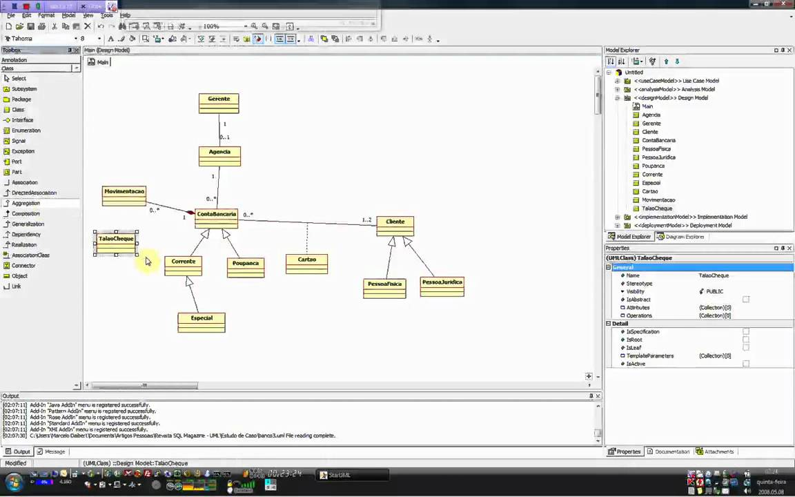

# RELACION DE CLASES
## Herencia
Se establece una jerarquía de clases y subclases que poseen atributos y/o métodos comunes. La superclase es la que debe declarar estos atributos y/o métodos, que heredarán las subclases
teniendo las siguiente clases:
```mermaid
    classDiagram
    class Cuenta_corriente{
        -numero: String
        -saldo: float
        -saldoMedio: float
    }
    class Cuenta_de_ahorro{
        -numero: String
        -saldo: float
        -interes: float
    }
 ```
 Con la herencia correspondiente seria asi:
 ```mermaid
 classDiagram 
    class Cuenta_corriente{
        -numero: String
        -saldo: float
        -saldoMedio: float
    }
    class Cuenta_de_ahorro{
        -numero: String
        -saldo: float
        -interes: float
    }
    Cuenta_corriente--|>Cuenta_de_ahorro
 ```
en java seria:
```java
// Clase base CuentaCorriente
class CuentaCorriente {
    private String numero;
    private float saldo;
    private float saldoMedio;

    public CuentaCorriente(String numero, float saldo, float saldoMedio) {
        this.numero = numero;
        this.saldo = saldo;
        this.saldoMedio = saldoMedio;
    }

    public String getNumero() {
        return numero;
    }

    public float getSaldo() {
        return saldo;
    }

    public float getSaldoMedio() {
        return saldoMedio;
    }

    public void depositar(float monto) {
        saldo += monto;
    }

    
}

//clase cuentadeahorro que hereda de Cuenta corriente y añade el interes
class CuentaDeAhorro extends CuentaCorriente {
    private float interes;

    public CuentaDeAhorro(String numero, float saldo, float saldoMedio, float interes) {
        super(numero, saldo, saldoMedio);
        this.interes = interes;
    }

    public float getInteres() {
        return interes;
    }

    
}

```
## Asociación
Las clases, en programación, tratan de representar conceptos del mundo real. Como norma general, no aparecen solas, sino que están relacionadas con otras.
Las asociaciones tienen cardinalidades que son
* 1:uno una clase solo tiene uno de la otra clase
Diagrama:

Java:
```java
class Persona {
    private String nombre;
    private DNI dni;

    public Persona(String nombre, DNI dni) {
        this.nombre = nombre;
        this.dni = dni;
    }

    public DNI getDni() {
        return dni;
    }
}

class DNI {
    private String numero;

    public DNI(String numero) {
        this.numero = numero;
    }

    public String getNumero() {
        return numero;
    }
}
```

* 0..1:0 o 1: puede tenerlo o no tenerlo

Diagrama:

Java:
```java
class Empleado {
    private String nombre;
    private Oficina oficina; // Puede ser null (0..1)

    public Empleado(String nombre, Oficina oficina) {
        this.nombre = nombre;
        this.oficina = oficina;
    }

    public Oficina getOficina() {
        return oficina;
    }
}

class Oficina {
    private String direccion;

    public Oficina(String direccion) {
        this.direccion = direccion;
    }

    public String getDireccion() {
        return direccion;
    }
}
```
* 0.*
  puede ser nada o varios
  
Diagrama
```mermaid
classDiagram
    class Cliente {
        -nombre: String
    }
    class Pedido {
        -id: int
    }
    Cliente "0..*" --> Pedido : 
```
Java:
```java
import java.util.ArrayList;
import java.util.List;

class Cliente {
    private String nombre;
    private List<Pedido> pedidos; // 0 o más pedidos

    public Cliente(String nombre) {
        this.nombre = nombre;
        this.pedidos = new ArrayList<>();
    }

    public void agregarPedido(Pedido pedido) {
        pedidos.add(pedido);
    }

    public List<Pedido> getPedidos() {
        return pedidos;
    }
}

class Pedido {
    private int id;

    public Pedido(int id) {
        this.id = id;
    }

    public int getId() {
        return id;
    }
}

```
* 1..* 1 a varios
  ```mermaid
  classDiagram
    class Profesor {
        -nombre: String
    }
    class Curso {
        -nombre: String
    }
    Profesor "1..*" --> "1" Curso : imparte
  ```
  Java:
 ```java
 import java.util.HashSet;
import java.util.Set;

class Profesor {
    private String nombre;
    private Set<Curso> cursos; // Uno o más cursos

    public Profesor(String nombre) {
        this.nombre = nombre;
        this.cursos = new HashSet<>();
    }

    public void agregarCurso(Curso curso) {
        cursos.add(curso);
    }

    public Set<Curso> getCursos() {
        return cursos;
    }
}

class Curso {
    private String nombre;

    public Curso(String nombre) {
        this.nombre = nombre;
    }

    public String getNombre() {
        return nombre;
    }
}
```
* NyM entre dos numeros
  Diagrama(programa completo)
  ```mermaid
  classDiagram
  class Jugador {
        -nombre: String
        -equipos: Set<Equipo>
        -MIN_EQUIPOS: int = 2
        -MAX_EQUIPOS: int = 5
        +agregarEquipo(equipo: Equipo) boolean
        +validarCantidadEquipos() boolean
        +getEquipos() Set<Equipo>
        +getNombre() String
    }

    class Equipo {
        -nombre: String
        +getNombre() String
    }

    class Main {
        +main(args: String[]) void
    }

    Jugador "2..5" --> "1" Equipo : pertenece a
    Main --> Jugador : prueba la relación
    Main --> Equipo : crea instancias de
  ```
  Java
```java
import java.util.HashSet;
import java.util.Set;

class Jugador {
    private String nombre;
    private Set<Equipo> equipos;
    private static final int MIN_EQUIPOS = 2; // N mínimo
    private static final int MAX_EQUIPOS = 5; // M máximo

    public Jugador(String nombre) {
        this.nombre = nombre;
        this.equipos = new HashSet<>();
    }

    public boolean agregarEquipo(Equipo equipo) {
        if (equipos.size() < MAX_EQUIPOS) {
            equipos.add(equipo);
            return true;
        } else {
            System.out.println("El jugador ya está en el máximo de " + MAX_EQUIPOS + " equipos.");
            return false;
        }
    }

    public boolean validarCantidadEquipos() {
        return equipos.size() >= MIN_EQUIPOS;
    }

    public Set<Equipo> getEquipos() {
        return equipos;
    }

    public String getNombre() {
        return nombre;
    }
}

class Equipo {
    private String nombre;

    public Equipo(String nombre) {
        this.nombre = nombre;
    }

    public String getNombre() {
        return nombre;
    }
}

public class Main {
    public static void main(String[] args) {
        Jugador jugador = new Jugador("Leo Messi");

        Equipo equipo1 = new Equipo("Barcelona");
        Equipo equipo2 = new Equipo("PSG");
        Equipo equipo3 = new Equipo("Inter Miami");
        Equipo equipo4 = new Equipo("Newell's Old Boys");
        Equipo equipo5 = new Equipo("Argentina");
        Equipo equipo6 = new Equipo("Manchester City"); // Extra para probar el límite

        jugador.agregarEquipo(equipo1);
        jugador.agregarEquipo(equipo2);
        jugador.agregarEquipo(equipo3);
        jugador.agregarEquipo(equipo4);
        jugador.agregarEquipo(equipo5);
        jugador.agregarEquipo(equipo6); // No debería agregarse

        System.out.println("Equipos en los que juega " + jugador.getNombre() + ":");
        for (Equipo e : jugador.getEquipos()) {
            System.out.println("- " + e.getNombre());
        }

        if (!jugador.validarCantidadEquipos()) {
            System.out.println("El jugador no cumple con el mínimo de " + Jugador.MIN_EQUIPOS + " equipos.");
        }
    }
}
  ```
## Clases abstractas
Se pone el nombre de la clase en cursiva.
Tienen al menos un método abstracto. Los métodos abstractos también se ponen en cursiva.
Una clase abstracta en Java es una clase que no puede ser instanciada y que puede contener métodos abstractos (sin implementación) y métodos concretos (con implementación). 

```java
// Clase abstracta
abstract class Animal {
    // Método abstracto (debe ser implementado por las subclases)
    abstract void hacerSonido();
    
    // Método concreto con implementación
    void dormir() {
        System.out.println("El animal duerme");
    }
}

// Subclase concreta que extiende de Animal
class Perro extends Animal {
    @Override
    void hacerSonido() {
        System.out.println("El perro ladra: ¡Guau guau!");
    }
}

// Otra subclase concreta que extiende de Animal
class Gato extends Animal {
    @Override
    void hacerSonido() {
        System.out.println("El gato maulla: ¡Miau miau!");
    }
}

// Clase principal para probar el código
public class Main {
    public static void main(String[] args) {
        Animal miPerro = new Perro();
        Animal miGato = new Gato();

        miPerro.hacerSonido();
        miPerro.dormir();

        miGato.hacerSonido();
        miGato.dormir();
    }
}
```
## Atributos y métodos estáticos.
se indica con un subrrayado son atributos que no se reiniciaran atraves de los objetos:
en diagrama:

en java:
```java
public class MiClase {
    public int atributoInstancia;
    public static int atributoEstatico;
    public void metodoInstancia() {
        // Lógica del método de instancia
    }
    
    // Método estático
    public static void metodoEstatico() {
        // Lógica del método estático
    }
}
```
## Herramientas para hacer diagramas
* MagicDraw:
Es una herramienta avanzada de modelado UML que permite crear diagramas estructurados y de comportamiento, facilitando la colaboración en equipos y la integración con procesos de ingeniería de software.

* Visual Paradigm:
Es una completa plataforma de modelado visual que soporta UML, BPMN y otros tipos de diagramas, ideal para el análisis, diseño y gestión de procesos empresariales.

* Modelio:
Es un entorno de modelado de código abierto que admite UML y BPMN, ofreciendo flexibilidad para personalizar y gestionar proyectos de software con herramientas adicionales para documentación y extensibilidad.

* StarUML:
Es una herramienta UML multiplataforma con una interfaz intuitiva, que soporta una amplia variedad de diagramas (incluyendo SysML) y se destaca por su capacidad de extensibilidad y facilidad de uso.<br>




* UMLet:
Es un editor UML ligero y de código abierto, diseñado para crear diagramas de manera rápida y sencilla a través de una interfaz minimalista y basada en texto.

* diagrams.net:
Anteriormente conocido como draw.io, es un editor de diagramas en línea gratuito que permite elaborar diagramas UML y de otros tipos mediante una intuitiva interfaz de arrastrar y soltar.


  
